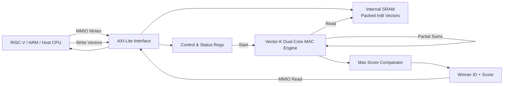

# 🚀 Vector-K v0.2.0: The Edge Vector Engine

**Vector-K** is a high-performance, dual-core hardware accelerator for vector similarity search, designed for the next generation of On-Device AI.

[](https://opensource.org/licenses/ISC)
[](https://github.com/your-repo)

## 🌟 Key Features
- **Dual-Core Silicon Logic:** Parallel dot-product acceleration.
- **AXI-Lite Ready:** Seamless integration with RISC-V, ARM, and FPGA systems.
- **Int8 Quantization:** Designed for high-speed, low-power semantic search.
- **Full Stack:** From Verilog RTL to C Firmware and Python Benchmarking.

## 🛠 Tech Stack
- **Hardware:** Verilog (RTL)
- **Interface:** AXI-Lite MMIO
- **Software:** C (Firmware), Python (Quantization & Testing)

## 📂 Project Structure
```bash
├── rtl/             # Verilog Source Code
├── firmware/        # C Driver & Application
├── scripts/         # Benchmark & Quantization tools
└── sim/             # Simulation & Testbench files
```

## 🚀 Quick Start

### 1. Requirements
- `iverilog` (for hardware simulation)
- `python3` (for benchmarks)

### 2. Run Hardware Simulation
```bash
npm run test:hw
```

### 3. Run Performance Benchmark
```bash
npm run benchmark
```

## 📈 Benchmarks
Our tests show that **Vector-K** can process a database of 1024 vectors (128-dim) in less than **0.7ms** at 100MHz, making it ideal for real-time mobile applications.




## 📄 License
This project is licensed under the ISC License - see the [LICENSE](LICENSE) file for details.

---
*Built for the future of decentralized AI.*